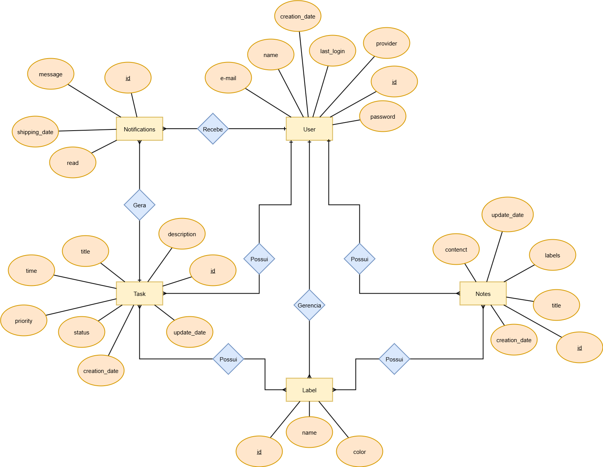
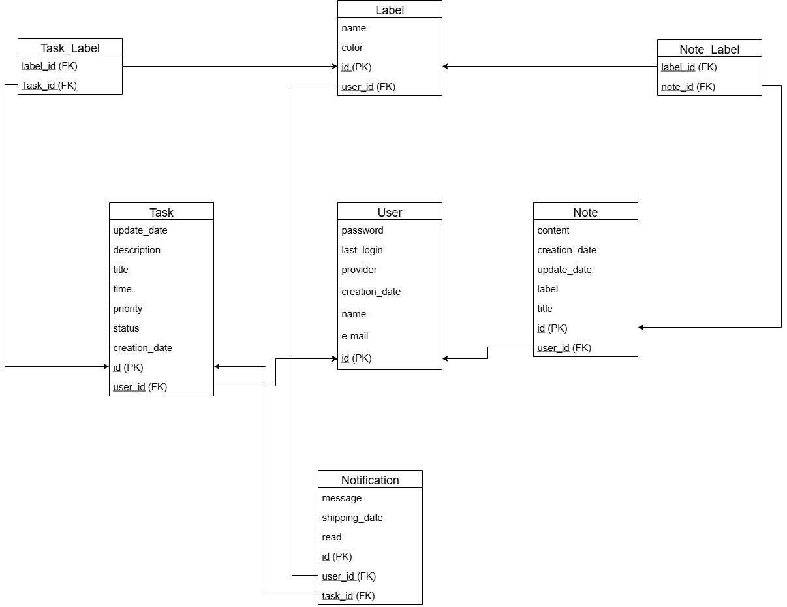

# Modelo De Dados

## Diagrama Lógico de Entidade-Relacionamento

O Modelo Lógico Entidade-Relacionamento (ER) foi elaborado com o objetivo de representar de forma conceitual como as principais entidades do sistema se relacionam. Nesse diagrama, destacam-se as entidades Usuário, Nota, Tarefa, Etiqueta e Notificação, bem como suas relações: um usuário pode possuir diversas notas e tarefas, cada tarefa pode gerar notificações e tanto notas quanto tarefas podem estar vinculadas a etiquetas. O modelo ER, portanto, fornece uma visão clara e semântica da estrutura do sistema, servindo como base para a modelagem de dados.

## Diagrama do Modelo Relacional

Já o Modelo Relacional traduz esse conceito para uma visão mais próxima da implementação em banco de dados. Nesse diagrama, as entidades foram representadas como tabelas com seus respectivos atributos, chaves primárias e estrangeiras, permitindo identificar de forma precisa como os dados serão armazenados e relacionados no sistema. Essa etapa é fundamental para garantir consistência, normalização e suporte adequado às funcionalidades definidas nos requisitos.

